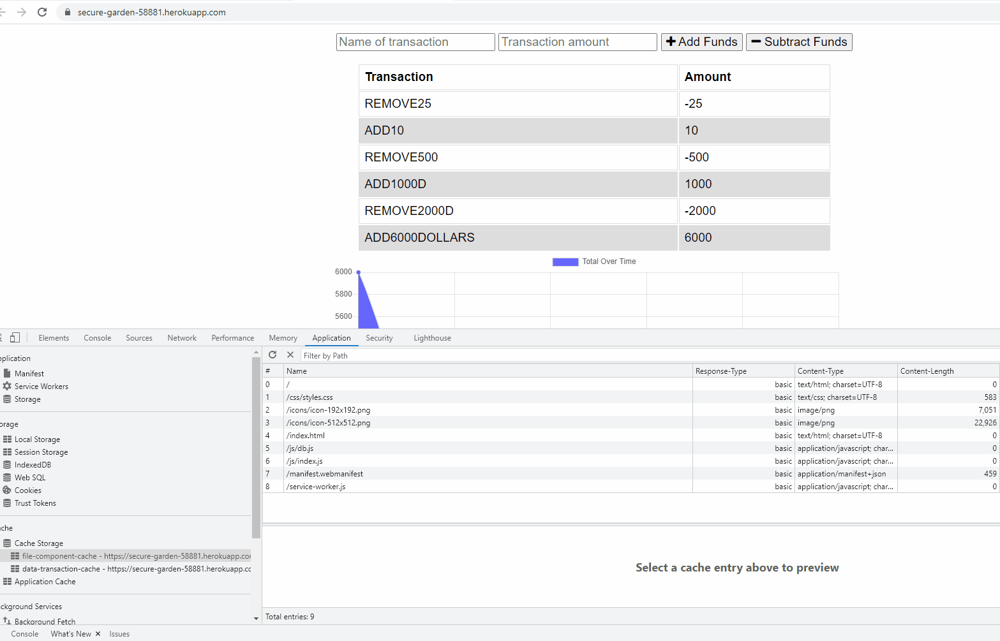
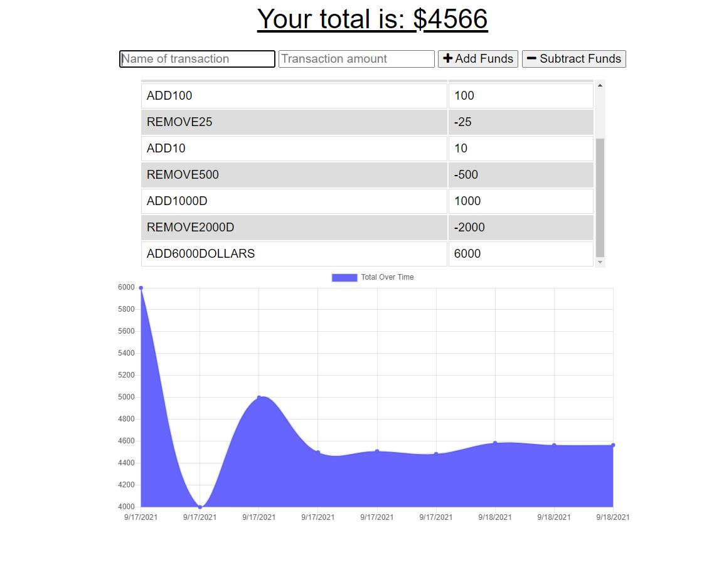

# offline-online-budget-track
* The main concept is  about storing expense transactions online -offline ;The mongo DB here is budget and its table/collections is  transactions.When you add and subract funds with app ONLINE the entries move into mongo DB ;When you go OFFLINE(service worker) and make transactions the are stored  in indexedDB and not Atlas MongoDB;Once you uncheck offline mode and resume online
all recent offline and online transactions are in Atlas Mongo DB .The offline and online transactions are captured in  cache too(api/transaction)
* Challenges -including local host  ,Heroku deployment,Service worker issues  where Stackoverflow and other google search /forums helped.
* Thanks to my tutor Alexis San Javier for - helping me with HW especially when GHcode changes  would not get deployed to Heroku;Helping me  understand  the concept  of clearing -deleting  cache/indexedDB storage , dropping DB collections  ,unregistering  service worker to make deployment/HW work.A Big Learning here
* Budget icons have a  warning message -tried working with my tutor but did not get the desired result. But was able to download my app.The app sometimes toggles between caches ( 1 to  2 -Click api/transactions for all budget transactions). Worked well earlier but now needs to be reworked.I still  continue to have issues with GH push to Heroku deploys now and then (mystery)

* Deployed GH https://github.com/JudyMotha/offline-online-budget-track
* DEployed Heroku link  https://secure-garden-58881.herokuapp.com/

* Visuals

 
* Cache Storage components

* The Tracker

